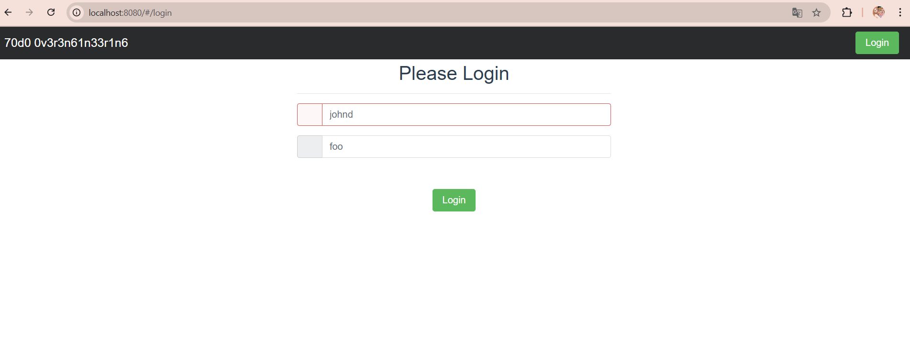
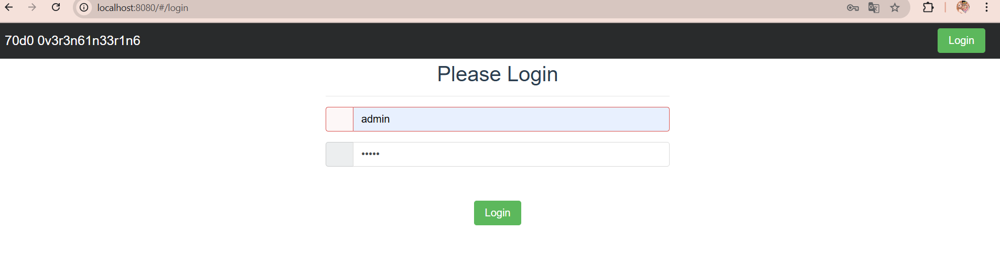
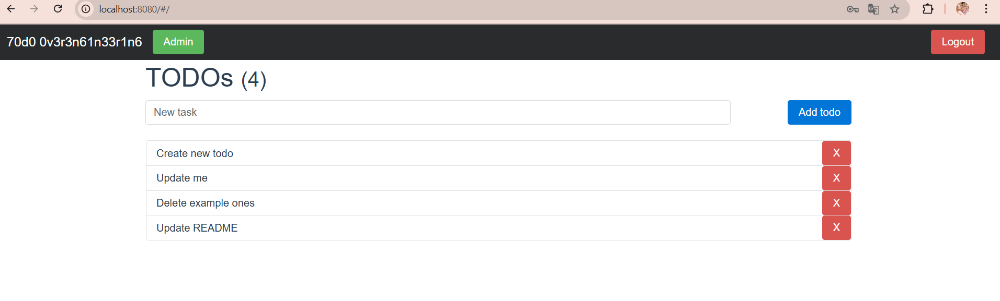

# Microservice App - PRFT Devops Training

This is the application you are going to use through the whole traninig. This, hopefully, will teach you the fundamentals you need in a real project. You will find a basic TODO application designed with a [microservice architecture](https://microservices.io). Although is a TODO application, it is interesting because the microservices that compose it are written in different programming language or frameworks (Go, Python, Vue, Java, and NodeJS). With this design you will experiment with multiple build tools and environments. 

## Components
In each folder you can find a more in-depth explanation of each component:

1. [Users API](/users-api) is a Spring Boot application. Provides user profiles. At the moment, does not provide full CRUD, just getting a single user and all users.
2. [Auth API](/auth-api) is a Go application, and provides authorization functionality. Generates [JWT](https://jwt.io/) tokens to be used with other APIs.
3. [TODOs API](/todos-api) is a NodeJS application, provides CRUD functionality over user's TODO records. Also, it logs "create" and "delete" operations to [Redis](https://redis.io/) queue.
4. [Log Message Processor](/log-message-processor) is a queue processor written in Python. Its purpose is to read messages from a Redis queue and print them to standard output.
5. [Frontend](/frontend) Vue application, provides UI.

## Architecture

Take a look at the components diagram that describes them and their interactions.


# Despliegue de Microservicios con Docker

En este repositorio cada microservicion ya tiene su respectivo `Dockerfile` con todo lo necesario para su construcción. Por temas de practicidad se creo un script Bash que despliega un conjunto de microservicios utilizando Docker. Incluye la construcción de imágenes y la ejecución de contenedores en una red personalizada.

## Descripción

El script realiza los siguientes pasos:

1. **Crear la red:** Se crea una red llamada `microservices-network` si no existe, utilizando el comando:

    ```sh
    docker network create microservices-network || true
    ```

2. **Construcción de Imágenes:** Se construyen las imágenes de Docker para cada servicio utilizando los siguientes comandos:

    ```sh
    docker build -t redis-image ./redis
    docker build -t zipkin-image ./zipkin
    docker build -t usersapi-image ./users-api
    docker build -t authapi-image ./auth-api
    docker build -t todosapi-image ./todos-api
    docker build -t frontend-image ./frontend
    ```

**Nota:** se crean primero los servicios de redis y zipkin ya que son necesarios para otros microservicios, es decir dependen de ellos.

3. **Ejecución de Contenedores:** Se ejecutan los contenedores en orden, conectándolos a la red `microservices-network`. Se exponen los puertos necesarios para cada servicio:

    ```sh
    docker run -d --name redis --network microservices-network -p 6379:6379 redis-image
    docker run -d --name zipkin --network microservices-network -p 9411:9411 zipkin-image
    docker run -d --name usersapi --network microservices-network -p 8083:8083 usersapi-image
    docker run -d --name authapi --network microservices-network -p 8000:8000 authapi-image
    docker run -d --name todosapi --network microservices-network -p 8082:8082 todosapi-image
    docker run -d --name frontendapi --network microservices-network -p 8080:8080 frontend-image
    ```

## Requisitos Previos

- Docker instalados en el sistema.
- Acceso a la línea de comandos.

## Uso

Para ejecutar el script, utiliza:

```sh
./nombre-del-script.sh
```

Esto construirá las imágenes y desplegará los contenedores en la red `microservices-network`.
## Funcionamiento








## <b> Autora </b>

+ [Gloria Vanesa](https://github.com/Vanesa155 "Vanesa V.")

[](https://forthebadge.com)